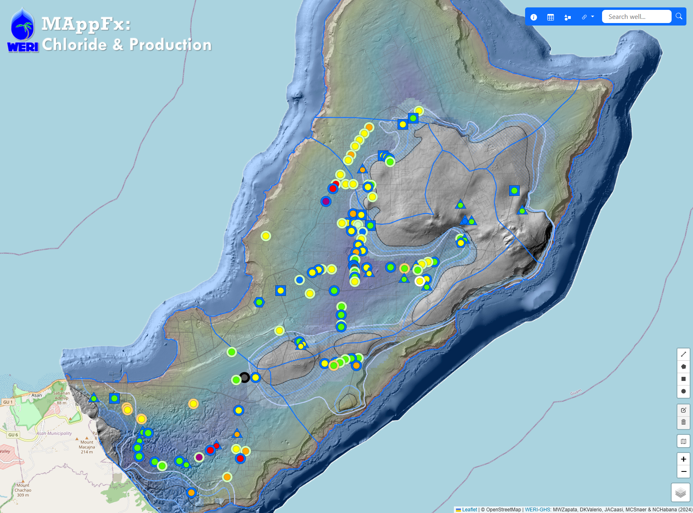

<h1 align="center">MAppFx: Chloride & Production</h1>

<i><b>Figure 1.</b>Preview of map user interface with data points.</i>

## Abstract 

Obtaining comprehensive data on water quality and production rates is crucial for effective water resource management. Chloride concentration data is an essential parameter for assessing the water quality, compliance with regulations, and pump rate management. The Northern Guam Lens Aquifer (NGLA), which serves as Guam's primary source of utility water, plays a critical role in sustaining the island's water supply. Within this aquifer lie numerous wells, their pump rates are regularly monitored with respect to chloride due to saltwater intrusion or updraw. Management of utility water production requires quick access to time-series graph of production and chloride for each of the 100 wells that produce about a total of 40 MGD.

WERI's MAppFx platform offers an interactive map environment on a web page, enabling users to retrieve graphs of specific sites by clicking on map features such as points, polygons, or lines. MAppFx is a data visualization tool that incorporates a user-friendly interface, empowering users and stakeholders to make informed decisions regarding water resource management. The growing presence of online web applications with mapping and graphing features offers an opportunity to revolutionize hydrologic data analysis, enabling users to visualize complex datasets and derive valuable insights for decision-making.

The use of this dataset to develop these responsive features expands the interagency web map products and is now available on the Guam Hydrologic Survey (GHS) website (guamhydrologicsurvey.uog.edu), Guam’s online repository of pertinent hydrologic information established by Guam’s public laws. With the established website and new online interactive interface technology available, the GHS Information Management Team are now inclined to pursue the expansion of hydrologic web products and field survey database. The ever-growing GHS website product is a true testament to interagency collaboration, a great means of hydrologic information, dissemination, and scientific information source for aquifer management.

> Keywords: chloride, production wells, data visualization, Northern Guam Lens Aquifer, hydrologic information database

## WERI Technical Report (coming soon)

The technical report for this project is in progress and will soon be available online through the WERI website's _Reports and Publications_ section, [here](https://weri.uog.edu/reports-and-publications/). It will also be available through the Guam Hydrologic Survey website, [here](https://guamhydrologicsurvey.uog.edu/index.php/mappfx/).

## Authors & Developers
D.K. Valerio, M.W. Zapata & N.C. Habana

## Contributors 
J.A. Caasi & M.C. Snaer 